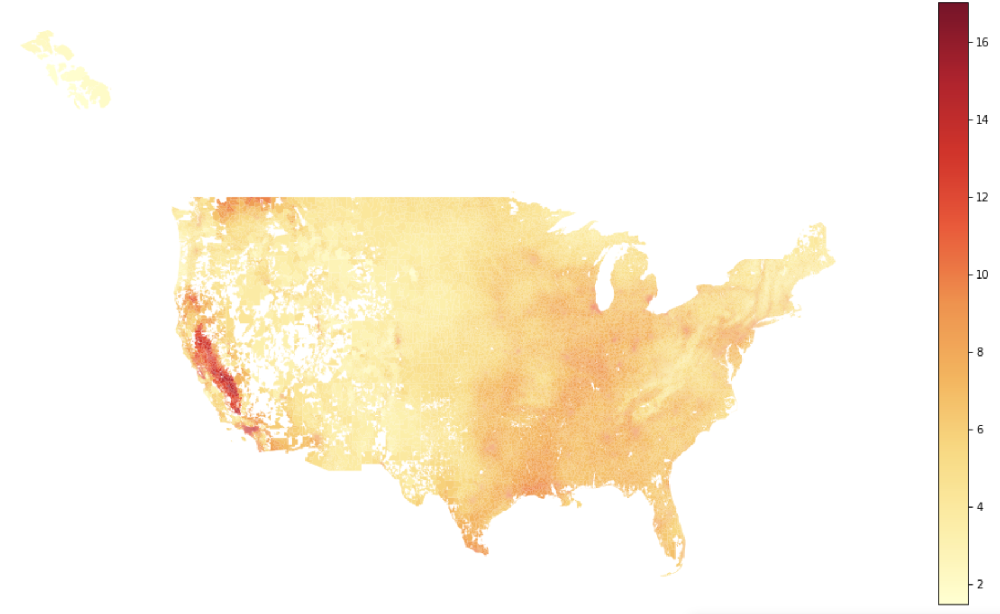

# PM 2.5 Components - Randall Martin Data

This repository focuses on processing and aggregating netCDF exposure data from [Randall Martin's data](https://sites.wustl.edu/acag/datasets/surface-pm2-5/). The processing involves applying a [downscaling](https://en.wikipedia.org/wiki/Downscaling) rasterization strategy using [TIGER/Line Shapefiles](https://www.census.gov/geographies/mapping-files/time-series/geo/tiger-line-file.2000.html#list-tab-790442341).

## Pipeline and Code

The entire pipeline for rasterization and aggregation can be found in the [nsaph-gis repository](https://github.com/NSAPH-Data-Platform/nsaph-gis/tree/develop/nsaph_gis/). This includes the process of converting the netCDF data to raster format and further aggregation based on geospatial features.


## PM2.5 Components Annual Data per ZCTA

This dataset provides comprehensive insights into the annual distribution of PM2.5 (Particulate Matter with a diameter of 2.5 micrometers or smaller) components across different Zip Code Tabulation Areas (ZCTAs). PM2.5 is a critical air pollutant with potential health and environmental impacts. This data highlights the individual components that contribute to PM2.5 levels, offering valuable information for air quality research and policymaking.

The dataset covers various PM2.5 components, including:

- **BC (Black Carbon):** A fine particulate matter produced by incomplete combustion of carbon-based fuels.
- **NH4 (Ammonium):** A compound formed from ammonia gas, commonly found in airborne particles.
- **NIT (Nitrate):** Nitric acid and nitrate salts, which are major constituents of PM2.5 particles.
- **OM (Organic Matter):** Carbon-containing compounds from organic sources, contributing to particle mass.
- **SO4 (Sulfate):** Sulfuric acid and sulfate salts, originating from industrial and natural sources.
- **SOIL (Soil Dust):** Particles from soil erosion and mineral dust suspended in the air.
- **SS (Sea Salt):** Particles generated from ocean spray, containing various minerals.

The data is organized by year and ZCTA, providing annual averages for each PM2.5 component. This dataset aids in understanding the composition and variations of PM2.5 across different geographical areas. It plays a crucial role in studying pollution sources, assessing health risks, and formulating air quality regulations.

Data result: 

|      PM25  |       BC |       NH4 |      NIT |       OM |      SO4 |     SOIL |        SS |  zcta | Year |
|-----------:|---------:|---------:|--------:|--------:|--------:|--------:|---------:|------:|-----:|
|    8.83166 | 0.514387 | 1.034189 | 2.01351 | 2.57810 | 2.06707 | 0.535199 | 0.0900462 | 50174 | 2000 |
|    8.85045 | 0.514884 | 1.036001 | 1.98469 | 2.61124 | 2.07467 | 0.538295 | 0.0891946 | 50254 | 2000 |
|    8.93447 | 0.488158 | 1.058558 | 2.01530 | 2.63659 | 2.09997 | 0.544718 | 0.0894424 | 50830 | 2000 |
|    8.88856 | 0.479013 | 1.037878 | 2.05407 | 2.60047 | 2.09750 | 0.534648 | 0.0907961 | 50149 | 2000 |
|    8.10734 | 0.466201 | 0.958111 | 1.73319 | 2.34420 | 2.01851 | 0.466201 | 0.123487  | 52573 | 2000 |
|    8.46975 | 0.477376 | 1.030934 | 1.81464 | 2.44444 | 2.07887 | 0.477376 | 0.150484  | 52542 | 2000 |


## Exploratory Data Analysis (EDA)

The accompanying notebook contains basic exploratory data analysis for the netCDF data and visualization of the rasterization results. 

Here is the example of coverage map for year 2018: 



## <a name="_3pvqmuyiayzd"></a>Steps to reproduce running Gridmet pipeline in CANNON for  PM25 components aggregation:
Summarized from: <https://3.basecamp.com/3348350/buckets/29048408/messages/6023800231#__recording_6067667051> 

### Data Location

- Smoke PM25 components data: [Link](https://vdi.rc.fas.harvard.edu/pun/sys/dashboard/files/fs//net/rcstorenfs02/ifs/rc_labs/dominici_lab/lab/data/pm25_components)
- Shapefiles data: [Link](https://vdi.rc.fas.harvard.edu/pun/sys/dashboard/files/fs//net/rcstorenfs02/ifs/rc_labs/dominici_lab/lab/data/zipcode/polygon)
- Pipelines: [Link](https://vdi.rc.fas.harvard.edu/pun/sys/dashboard/files/fs//net/rcstorenfs02/ifs/rc_labs/dominici_lab/lab/data_processing)

### <a name="_fzpsk6d543ow"></a>Connecting to CANNON VPN: 
- Follow these steps: <https://nsaph.info/cannon.html>  
- Open fasrc vpn: for username, type `username@fasrc`
- Setup remote desktop on CANNON, usually I use partition `serial\_requeue` because it is the fastest one 

### <a name="_u0xqpvutvpc3"></a>Clone Github Repos: 
Make sure you have cloned and run `pip install .` from all of these repos:

- [nsaph-core-platform](https://github.com/NSAPH-Data-Platform/nsaph-core-platform/tree/develop)
- [nsaph-gis](https://github.com/NSAPH-Data-Platform/nsaph-gis)
- [nsaph-gridmet](https://github.com/NSAPH-Data-Platform/nsaph-gridmet)
- [nsaph-platform-deployment](https://github.com/NSAPH-Data-Platform/nsaph-platform-deployment)
- [Nsaph-utils](https://github.com/NSAPH-Data-Platform/nsaph-utils)
### <a name="_koxy2eqfcoee"></a>Setting up the environment: 
Run these commands: 
```
module load Anaconda

source activate /net/rcstorenfs02/ifs/rc\_labs/dominici\_lab/lab/environments/exposures\_no\_r

PS1='\u@\h:\W$
```

### <a name="_uxh7esti8run"></a>Run PM25 Aggregation from NetCDF LON and LAT level to crosswalk with ZCTA: 


Run this command: 
```
python -u -m pollution.wustl\_file\_processor --geography zcta --raw\_downloads /net/rcstorenfs02/ifs/rc\_labs/dominici\_lab/lab/data/pm25\_components/PM25/V4NA03\_PM25\_NA\_200001\_200012-RH35.nc --shape\_file\_collection tiger --destination /net/rcstorenfs02/ifs/rc\_labs/dominici\_lab/lab/data\_processing/netcdf\_aggregator/kezia/data/intermediate --var pm25 --strategy downscale 
```

Parameters: 

- –geography: geospatial instance (e.g: zip, zcta, county)
- –raw\_downloads: input file
- –shape\_files: location of shapefile 
- –shape\_file\_collection: collection of shapefile (e.g: tiger)
- –destination: output folder
- –var: variable name (e.g: pm25)
- –strategy: rasterization strategy (e.g: downscale)
### <a name="_crov0h4p3m7q"></a>To run with parallelization: 
Steps to update the environment on Cannon (already done, no need to repeat):
```
cd /net/rcstorenfs02/ifs/rc\_labs/dominici\_lab/lab/data\_processing/nsaph-gridmet

git pull

conda env update -p /net/rcstorenfs02/ifs/rc\_labs/dominici\_lab/lab/environments/exposures\_no\_r -f data\_processing/nsaph-gridmet/env/exposures\_no\_r.yaml
```
Then, cd to the directory where you would like to run the pipeline. I used:

```
cd /net/rcstorenfs02/ifs/rc\_labs/dominici\_lab/lab/data\_processing/netcdf\_aggregator
```


The command I used to run the pipeline is:

```
nohup cwltool --leave-tmpdir --parallel /net/rcstorenfs02/ifs/rc\_labs/dominici\_lab/lab/data\_processing/nsaph-gridmet/src/cwl/pm25\_yearly\_download.cwl --downloads /net/rcstorenfs02/ifs/rc\_labs/dominici\_lab/lab/data/pm25\_components/PM25/ --geography zcta --shape\_file\_collection tiger 2>&1 > 1aggr.log &
```

Please note, that after successful completion of the pipeline, the directory will contain a [bunch of files](https://github.com/NSAPH-Data-Platform/nsaph-gridmet/blob/develop/src/cwl/pm25_yearly_download.cwl#L90-L110):

- Aggregation results (\*.csv.gz)
- Shape files
- logs (\*.log, \*.err) 

` `You would need to copy or move \*.csv.gz to the location of your preference.

The main log file is 1aggr.log, hence you can monitor the progress with the following command:

```
tail -f 1aggr.log
```

### <a name="_bsp9qgmk7ml3"></a>NetCDF Aggregation Before and After: 
Input data: 

File ../data/input/pm25\_components/PM25/V4NA03\_PM25\_NA\_200001\_200012-RH35.nc (NC\_FORMAT\_NETCDF4\_CLASSIC):

1 variables (excluding dimension variables):

float PM25[LON,LAT] (Chunking: [1329,650]) (Compression: level 5)

standard\_name: PM25

units: ug/m3

2 dimensions:

LON Size:9300

standard\_name: longitude

long\_name: longitude centre

units: degrees\_east

LAT Size:4550

standard\_name: latitude

long\_name: latitude centre

units: degrees\_north


